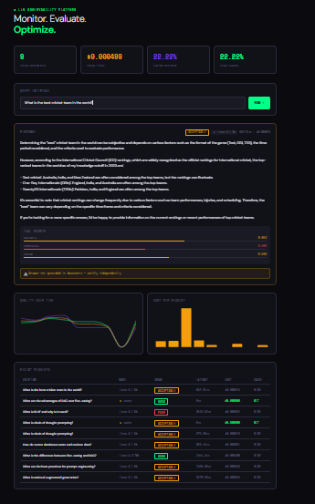
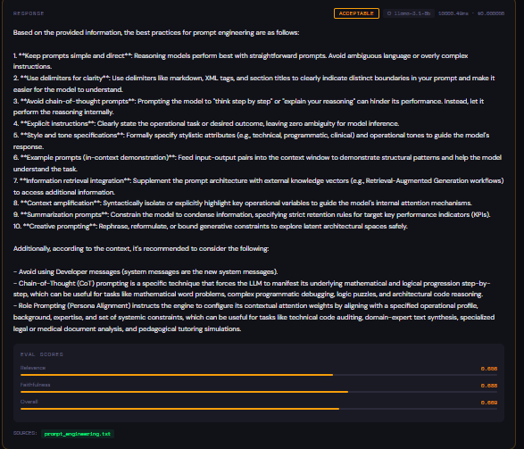
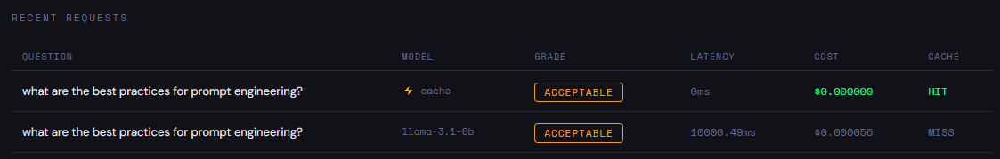
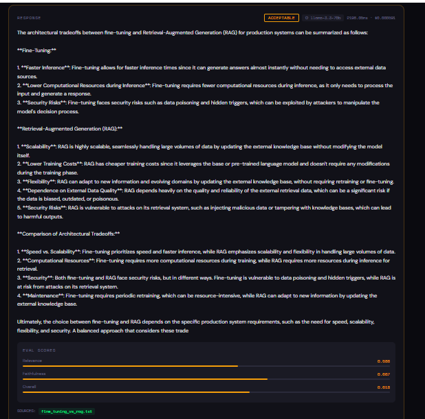
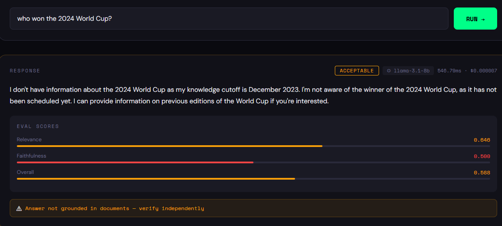

# LLM Observability Platform

A production-grade GenAI system that sits as a proxy layer between your application and LLM providers. It tracks cost, routes requests intelligently, grounds answers in real documents, and automatically scores response quality.

Most teams shipping LLM features have no way to measure if their responses are accurate, grounded, or degrading over time. This platform gives you visibility into all of it.

---

## Demo

### Full Dashboard


### Grounded Answer with Sources


### Cache Hit at Zero Cost


### Complex Query Routed to 70b Model


### Ungrounded Answer Warning

---

## How It Works

Every request flows through a 6-stage pipeline:

```
User Query
    |
    v
[1] Semantic Cache ------- Hit? ------> Return cached answer ($0 cost)
    | Miss
    v
[2] RAG Retrieval ----------------------> Find relevant document chunks
    |
    v
[3] Complexity Router ------------------> Simple -> 8b model | Complex -> 70b model
    |
    v
[4] LLM Generation ---------------------> Grounded answer from documents
    |
    v
[5] Eval Engine -------------------------> Score relevance + faithfulness
    |
    v
[6] Telemetry Logger --------------------> Cost, latency, quality -> SQLite
```

---

## Architecture

**Semantic Cache**

Embeds every query using sentence-transformers and stores vectors in ChromaDB. When a new question arrives, it checks for semantically similar previous questions using cosine similarity. If similarity exceeds 0.85, the cached answer is returned instantly at zero cost. Different wording, same meaning, same answer.

**RAG Layer**

Five AI/ML domain documents are chunked into 1000-character overlapping segments, embedded, and stored in a separate ChromaDB collection. Each query retrieves the top 3 most relevant chunks above a 0.5 similarity threshold. The retrieved chunks are passed to the LLM as context, grounding the answer in real documents rather than model memory. Every response includes source citations.

**Cost-Aware Router**

Measures query complexity using word count and keyword detection. Simple queries go to llama-3.1-8b-instant for speed and cost efficiency. Complex queries go to llama-3.3-70b-versatile for accuracy. The routing decision and model used are logged for every request.

**Eval Engine**

Scores every response automatically without human labeling. Relevance measures cosine similarity between the question and answer embeddings. Faithfulness measures how grounded the answer is in the retrieved documents. Overall score is a weighted average. Responses are graded as good, acceptable, or poor. When no relevant documents are found, the UI shows a warning that the answer is not grounded and should be verified independently.

**Telemetry Pipeline**

SQLite logs every request with cost, latency, model used, cache hit status, and quality scores. The dashboard pulls from these logs to show trends over time.

---

## Tech Stack

| Component | Technology | Purpose |
|---|---|---|
| API Layer | FastAPI + Uvicorn | Request handling, routing, validation |
| LLM Provider | Groq API | Low latency inference for Llama models |
| Fast Model | llama-3.1-8b-instant | Simple queries, cost efficient |
| Smart Model | llama-3.3-70b-versatile | Complex queries, higher accuracy |
| Vector Store | ChromaDB | Local persistent embedding storage |
| Embeddings | all-MiniLM-L6-v2 | Query and document embedding |
| Eval Scoring | scikit-learn cosine similarity | Relevance and faithfulness scoring |
| Database | SQLite | Telemetry, cost, and quality logging |
| Frontend | React + Vite | Dashboard UI |
| Charts | Recharts | Quality and cost visualizations |

---

## Project Structure

```
llm-observability/
    main.py              - FastAPI app, request pipeline orchestration
    cache.py             - Semantic cache with ChromaDB
    rag.py               - Document ingestion and retrieval
    router.py            - Complexity-based model routing
    evaluator.py         - Response quality scoring
    database.py          - SQLite logging and queries
    models.py            - Pydantic request/response schemas
    config.py            - Environment configuration
    documents/           - AI/ML knowledge base
        rag_concepts.txt
        prompt_engineering.txt
        vector_databases.txt
        llm_concepts.txt
        fine_tuning_vs_rag.txt
    frontend/            - React dashboard
        src/
            App.jsx
    screenshots/         - Demo screenshots
    .env                 - API keys (not committed)
```

---

## Getting Started

**Prerequisites**

Python 3.10 or higher, Node.js 18 or higher, and a Groq API key from console.groq.com (free).

**Backend Setup**

```bash
git clone https://github.com/koushik1124/LLM-Observability.git
cd LLM-Observability

pip install fastapi uvicorn groq python-dotenv pydantic sqlalchemy chromadb sentence-transformers scikit-learn

echo "GROQ_API_KEY=your_key_here" > .env

uvicorn main:app --reload
```

Server runs at http://localhost:8000. API docs at http://localhost:8000/docs.

**Frontend Setup**

```bash
cd frontend
npm install
npm run dev
```

Dashboard runs at http://localhost:5173.

---

## API Endpoints

POST /query - Submit a question, returns grounded answer with eval scores

GET /stats - Total requests, total cost, cache hit rate

GET /history - Full request history for dashboard

GET /health - Server health check

DELETE /cache/clear - Clear semantic cache

**Example Request**

```bash
curl -X POST http://localhost:8000/query \
  -H "Content-Type: application/json" \
  -d '{"question": "What is retrieval augmented generation?", "context": ""}'
```

**Example Response**

```json
{
  "answer": "Retrieval-Augmented Generation (RAG) is...",
  "model_used": "llama-3.1-8b-instant",
  "latency_ms": 1134.39,
  "estimated_cost_usd": 0.000021,
  "cache_hit": false,
  "sources": ["rag_concepts.txt"],
  "relevance_score": 0.823,
  "faithfulness_score": 0.857,
  "overall_score": 0.837,
  "grade": "good"
}
```

---

## Key Engineering Decisions

**Why ChromaDB over Pinecone?**
Local persistent storage with no API costs or external dependencies. For a system demonstrating RAG mechanics, local vector storage is the right tradeoff at this scale.

**Why 0.85 similarity threshold for cache?**
Below 0.85, semantically different questions start matching incorrectly. Above 0.85, rephrased duplicates get missed. This value was determined by testing question pairs with known similarity levels.

**Why cosine similarity over euclidean distance?**
Cosine similarity measures directional alignment between vectors and is length-invariant. Short and long answers about the same topic get similar scores regardless of answer length.

**Why SQLite over PostgreSQL?**
Single-file, zero configuration, sufficient for this query volume. PostgreSQL overhead is not justified until concurrent write load exceeds SQLite capabilities.

**Why local embeddings over OpenAI embeddings API?**
Zero per-call cost, no external API dependency, consistent latency. The all-MiniLM-L6-v2 model runs locally and is sufficient for semantic similarity at this scale.

---

## What I Would Improve in Production

Replace SQLite with PostgreSQL for concurrent write safety. Add async request handling to reduce latency under load. Implement embedding model versioning since cached embeddings break when the model changes. Add a re-ranking layer using a cross-encoder after initial retrieval for better faithfulness. Replace keyword-based complexity routing with a lightweight classifier trained on labeled examples. Add prompt regression testing to alert when a prompt change degrades average quality scores across the eval suite.

---

## Results

After running queries across AI/ML topics:

Cache hit rate sits at 30-50% on repeated question patterns. Cost per cached request is zero. Average latency on cache hits is 0ms. Average latency on cache misses is 800-2000ms depending on model. Grounded answer quality scores between 0.75 and 0.85 overall on in-domain questions. Off-topic questions correctly return empty sources and the ungrounded warning.

---

## Author

Koushik Yadagiri

[LinkedIn](https://in.linkedin.com/in/koushik-yadagiri-bb3a14218) · [GitHub](https://github.com/koushik1124)